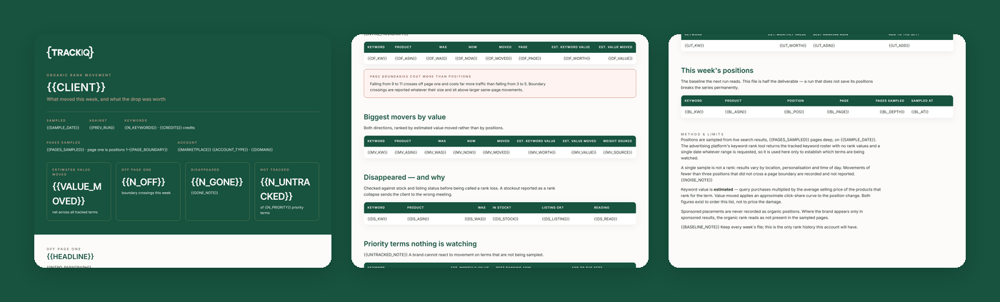

# TrackIQ: Amazon Organic Rank Movement Tracker

`trackiq-category-priority-keywords` produces the list of terms worth ranking for. On its first real run, **103 of 131 priority terms were not in the rank tracker at all.** That list is worthless unless something watches it afterwards.

**What moved this week, and what did the drop cost?**

Part of **Amazon Search & SEO** in the
[TrackIQ skills catalog](https://github.com/TrackIQ-HQ/amazon-seller-skills).

Built as an [Agent Skill](https://code.claude.com/docs/en/skills). Runs in
Claude Code, Claude web, Claude desktop and ChatGPT from the same folder.

---

## ⚠ This skill needs a scraper connection

Part of what this reads only exists on the public product page, so it needs an
**Oxylabs scraper** connection alongside the TrackIQ MCP. Scraper calls cost
credits per ASIN or keyword per run, and the skill states the run's cost in its
output.

There is no first-party substitute for the scraped fields — the skill says so
rather than approximating them.

---

## Powered by the TrackIQ MCP

[](https://trackiq.com/mcp)

This skill reads your live Amazon account through the
**[TrackIQ MCP](https://trackiq.com/mcp)** — 16 tools connecting your AI
assistant to Amazon data:

Sales & Traffic · Orders · Inventory · Returns · Sponsored Products · Sponsored
Brands · Sponsored Display · Amazon DSP · AMC Cloud · Keywords · Search Terms ·
Targeting · Search Query Performance · Organic Rank · Best Seller Rank · Buy Box
History · Brand Analytics · Export

Works with Claude, ChatGPT and Cursor. **[Get access →](https://trackiq.com/mcp)**

---

## What you get



Tracks weekly organic rank movement across a brand's priority keyword set by sampling live search results, compares it to the previous run, and weights every gain and loss by what that keyword is worth in revenue so the drops that cost real money surface first and the rest stay quiet. Use when the user asks about rank movement, organic rank changes, what moved this week, keyword rank tracking, did we lose rank, ranking report, or what a rank drop cost.

### The rules that keep it honest

- **`get_keyword_rank` does not return ranks**
- **Rank comes from sampling `search_keyword`**
- **Movement needs the previous run's file**
- **Dedupe the roster**

The full list is in `SKILL.md`, and each one exists because getting it wrong
produces a confident, wrong answer rather than an obvious error.

## Requirements

- **The Oxylabs scraper**, for `search_keyword` — this is where rank actually comes from. One credit per keyword per run. - The TrackIQ MCP, for `list_marketplaces`, `get_search_query_performance` (to weight each term) and `get_keyword_rank` (for the tracked roster, **not** for ranks). - **The previous run's file.** Movement needs a baseline and no tool stores one. - Nothing else. No filesystem, no shell. - **Without Oxylabs:** there is no rank source. Say so rather than presenting the roster as ranks.

---

## Install

### Claude Code

```
/plugin marketplace add TrackIQ-HQ/amazon-seller-skills
/plugin install trackiq-amazon-rank-movement@trackiq
```

### Claude web, desktop, mobile

1. Download the `.zip` from the
   [latest release](https://github.com/TrackIQ-HQ/trackiq-amazon-rank-movement/releases)
2. **Settings → Capabilities → Skills** (code execution must be on)
3. **Create skill → Upload a skill**, choose the `.zip`
4. Toggle it on

### ChatGPT

Same zip. **Plugins → Skills → Create → Upload from your computer.**

---

## Setup

Answers live in `account.md`, copied from
[`assets/account.example.md`](skills/trackiq-amazon-rank-movement/assets/account.example.md).
**Every TrackIQ skill reads the same file**, so an account already set up for
another TrackIQ report needs nothing added.

## Delivery

Asked once and stored in `account.md`: **in-chat** (default), **file**,
**Slack**, **n8n** or **email**. Anything leaving the chat confirms with you
first and falls back to in-chat, with a note.

---

## Customizing

| File | What it controls |
|---|---|
| `checks.md` | the pre-send checks |
| `method.md` | the method and every threshold |
| `pulls.md` | the call sequence and its traps |
| `report-template.html` | the report shell |

---

## Contributing

```bash
python scripts/validate.py    # must exit 0 before any commit
python scripts/build.py       # writes dist/ zip + registry.json
```

Read [AUTHORING.md](https://github.com/TrackIQ-HQ/amazon-seller-skills/blob/main/AUTHORING.md)
before proposing changes.

## License

MIT. See [LICENSE](LICENSE).
